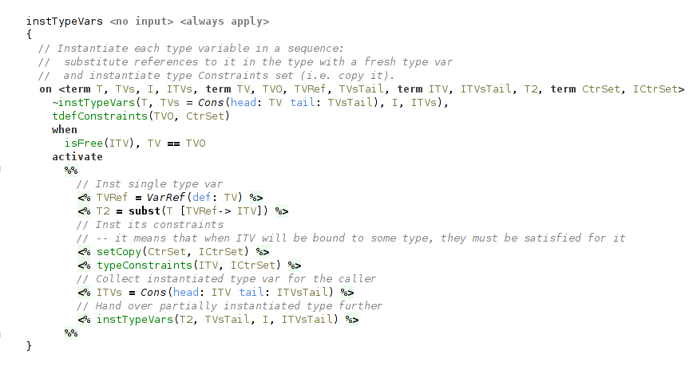

### Typechecking Lambda Calculus

Simply Typed Lambda Calculus (STLC) is a famous example favoured by textbook authors. This sample demonstrates how a classical type checking algorithm (Hindley-Milner) designed specifically for this language can be implemented using code rules.
It also presents two substantial extensions to basic Hindley-Milner type inference: type annotations and typeclasses from Haskell.
They will be discussed in succession, highlighting some of the useful features of code rules language and implementation challenges that type system itself introduces.

For purposes of keeping this sample small, we keep the language confined to boolean values. Aside of boolean constants `True` and `False`, the mandatory lambda abstraction and application, `let-in` expression, and `if-then-else`, we have in addition defined pairs of values and `fix` operator to support recursion.

The syntax of presented lambda calculus is compatible with Haskell, and consequently all examples can be typechecked with, for example, GHC (Glasgow Haskell Compiler).
The required extensions for GHC are:
- For basic STLC: `UnicodeSyntax` and `ExplicitForAll`
- For type annotations: `ScopedTypeVariables` and `RankNTypes`
- For typeclasses: `FlexibleInstances`
<!-- -- `OverlappingInstances` (optional) -->

<!-- ~some disclaimer: why typing rules may be different from more traditional type formulations, see below -->

The dataform table is trivial, there're two terms used in Cons-list implementation (`Cons` and `Nil`), term `Constraint` used in the part of type system concerned with typeclasses, and other expected terms for types (`Fun` for function type, `Forall` for universal types etc.).

There is only one query of kind `TYPECHECK`, which launches types recovery. All the type checking is done by the automatic productions “on start”.

#### Basic Hindley-Milner Type Inference

The basic type inference is covered by the several handlers: handler `typeOf` that contains most of the typing rules, handler `forall` covers typing of universal types, `recover` handler is concerned with translating inferred types back to SNodes representation, and `consList` is an utility handler.

<!-- TODO -->
<!-- EXAMPLES OF CONSTRUCTS & TYPE OUTPUT -->
<!--  -->
<!--  -->
<!--  -->
<!--  -->
<!--  -->

##### Cons-list

Handler `consList` is a straightforward implementation of Cons-list, present in all functional programming languages. Implementation consists of `Cons` and `Nil` data forms, `append` constraint and two rules that process it, one for common case and one for base case (when one of the input lists is empty).
There's also a helper function, that translates lists embedded in Code Rules to these ad-hoc Cons-lists.

##### Main Typechecking Rules

Handler `typeOf` contains most of the type inference rules.
Besides `typeOf` constraint it also declares a helper constraint `newTypeVars`. Its role is simple, it collects newly introduced type variables for later generalization on let-bindings.
Type variables are introduced at lambda-bindings and at instantiations of universal types.
Fresh type variables are represented simply by fresh logical variables.
For example, this is a rule for lambda-bindings:
<!-- A variable introduced by lambda abstraction is assigned a type, which is a fresh logical variable. -->

It's important to note that these variables can later be bound to something during the process of type inference, and so just before generalization on `let` we need to additionally check that the variables are indeed free.

Actually, the process of collecting free type variables could be implemented on the language level with a something like a predicate `term_variables/2` from Prolog, instead of manual tracking using `newTypeVars` constraint.

Typing rules for the most of the nodes are straightforward: rules match on `typeOf` and `newTypeVars` constraints of the node's children and produce these in their turn.
There're additional conditions on some of the rules, because their handling depends on whether these nodes are annotated or not. The case with annotations is processed in another handler `annotation`.
For example, in the case of unannotated let-binding we simply generalize over all free variables in the bound expression:

In the typing rule for variable occurences they are instantiated with a help of `inst` constraint.
It also returns a list of fresh instantiated variables.
This rule ensures that terms with universal types can actually be used polymorphically.

The type checking for `if-then-else` ensures that the types of both branches unify, and assigns the resulting unified type to the whole expression.

The most interesting rule here is for function application. Besides instantiating function, which may has polymorphic type, it also checks that the function can be applied to the argument, according to the types.
<!-- TODO about else branch -->

The subsumption relation on types, that checks this, comes from the need to account for type annotations and is covered later. In short, it handles the case when the actual argument has a more general (more polymorphic) type, than type of the formal parameter. In other words, when the parameter's type is _subsumed_ by the argument's type.
In the basic STLC formulation we would have here a usual unification between parameter's type and actual argument's type.

Finally, the `fix` operator, which represents general recursion, is given the type `∀ a. (a → a) → a`.
<!-- `forall a. (a -> a) -> a`. -->

##### Typechecking Universal Types

A separate handler is dedicated to producing and instantiating universal types, and it is the most interesting part of STLC.
The handler declares two general constraints `gen` and `inst` together with several helper constraints.

###### Generalization

`gen` constraint returns universal type through the logical variable passed as the first argument, accepts the type to generalize in the second argument and the type variables to generalize over (collected with `newTypeVars` constraint) in the third.
`gen` activates 2 helper constraints: the first processes type vars one by one (that's where the main work happens), and the second handles several different cases depending on the form of type that is generalized.

Generalization of a single free type variable consists from two steps.
The first step is concerned with typeclass constraints on type variables, and will be explained in the corresponding section below.
In short, we need to get the type constraints, that the type variable collected during type inference, and fix them, because they become a part of the definition of type variable in its type scheme and mustn't change.
The second step is a substitution of its occurences in the generalized type with references to a fresh type variable playing a role of its definition.
This is accomplished simply by a unification of free type var with `VarRef` data form, pointing to this fresh type var.

The fresh type variables are collected and then passed to the second helper constraint, that actually produces universal type.
It may appear, that in the type there're no free type variables to generalize over. In this case we shouldn't produce universal type.

In another case, when the generalized type is itself a universal type we merge the sets of the generalized type variables to avoid nested universal types.

And in the common case we just produce a universal type with processed type variables.

For example, generalizing a type `Fun(arg: A res: B)`, where `A` and `B` are free terms (type variables) we will get `Forall(type: Fun(arg: VarRef(def: C) res: VarRef(def: D)) typeVars: [C, D])`, where `C` and `D` are fresh variables.

###### Instantiation

Instantiation of a universal type mirrors generalization of a type.
`inst` constraint also depends on the form of a type being instantiated.
There're two cases: the trivial case, when the instantiated type is not a universal type, and the common case, when the instantiated type is really a universal type.
In the former case we essentially do nothing, and return the same type and an empty list of instantiated type variables.

The latter case uses a helper constraint, that processes bound type variables from universal type one by one.

Instantiation of a single bound type variable has two steps.
The first step is a substitution of all references to bound type variable with a fresh term.
It is done with a call to `subst`, a part of the internal API.
The second step is concerned with typeclass constraints. What we need to do here is to instantiate (copy, really) the set of typeclass constraints for the freshly instantiated type variable.
This variable is collected to the list of instantiated type variables for the caller.

##### Outputting Types

The handler `recover` is responsible for translating the calculated types to SNode form and is pretty straightforward. On each typeable node a `recover` constraint is activated. SNodes representing types are constructed using quotations.

The rules for type variables ensure that every one of them has an assigned name.
For variables without names assigned in type annotations the second rule will assign them with a help of `VarNames` utility.

    <!-- SHOW BOTH RULES -->

The most involved rule is for universal type, because it requires to recover and collect in a list SNodes representing type variables.
Analogously, for each type variable we need to recover and collect its typeclass constraints.

    <!-- SHOW FORALL RULES FOR FORALL & RECOVERTYPEVARS -->

