### Type Annotations

Extension of STLC with type annotations demonstrates two important points: a usage of Code Rules macros and an implementation of a relation between types in the form of constraint. Relations on types are present in many type systems, and probably the most widespread example is a subtyping relation (e.g. `isSubtype(type1, type2)`). As a matter of fact, the `subsumed` relation, presented here, is a form of subtyping too, as explained below.

#### Macros

Code Rules macros can help to keep the formulation of a type system cleaner, by moving out to a macro table some routine tasks, such as creating complex terms or building dataform representations of SNodes.
For such cases macros can be viewed as a form of constructors, when creation of a dataform requires, for example, recursive creation of subterms or production of constraints.

In this lambda calculus there's a single macro table called `types` for translation of SNodes, representing type annotations, to corresponding dataforms for manipulation in Code Rules program.

A typical example of a macro is for the function type. It recursively invokes macros for its argument and result types.

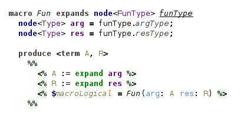  
_(macro for a function type)_

Macro for a type variable produces a fresh logical variable each time it is invoked.

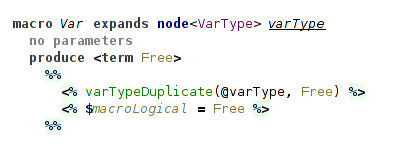  
_(macro for a type variable)_

As it can be invoked several times, we need to unify different logical variables emitted for a single type variable.
It is done in handler `annotation`.
We also emit a special constraint to carry type variable's name.
It's needed for outputting types in handler `recover` with expected names.

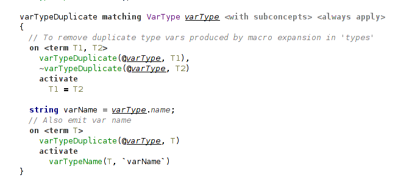  
_(unifying duplicate logical variables)_

All these macros are used in the handler `annotation` in a rule that produces a single constraint carrying the type from annotation:

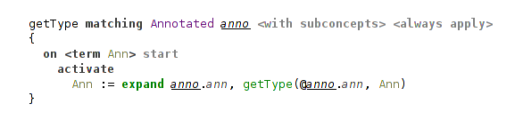  
_(usage of a macro expansion)_
<!-- _usage macro expansion for translating type SNode_ -->

Handler `annotation` defines several important rules.
Two of them are concerned with special handling of annotated bindings (let-binding and lambda-binding).
For lambda-binding we simply propagate the type from annotation, because at this point, at the introduction of a new variable, there're no constraints on it to check against.

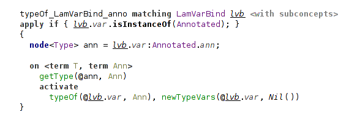  
_(annotated lambda-binding just assigns to its variable type from the annotation)_

The case of let-binding is different. Here we need to check the annotation against the inferred type of the bound expression. This is done with a help of `subsumed` constraint, explained below. It is the only difference of this typing rule from a rule for unannotated let-binding.

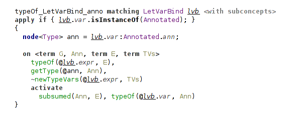  
_(annotated let-binding checks annotation against inferred type with `subsumed`)_

Another rule is concerned with annotated expressions.
In this case we check against the type of inferred expression, analogously to the rule for let-binding.

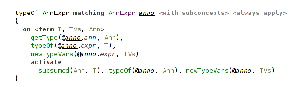  
_(annotated expression also includes `subsumed` check)_

In essence, this is all that is special about type annotations.
Most of the work and complexity is about `subsumed` relation to make the type system more expressive: it is concerned with higher-rank types.
We can substitute all occurrences of `subsumed` constraint for the unification predicate and get a usual STLC with simple type annotations, that must be equivalent to inferred types everywhere.

The following discussion is mostly concerned with a description of aspects of the type system and less so with Code Rules.

#### Higher-Rank Polymorphism

Type annotations provide us with a better understanding of the code.
For example, in Haskell it is considered a good practice to write type annotations for all top-level definitions.
But code documentation is not the only application of type annotations.

Hindley-Milner type inference is a very powerful type system and allows to write very generic programs without type annotations at all.
But that conciseness comes at a price. This type system doesn't cover all terms that a programmer <!-- (even a sane programmer) --> would like to write.
For example, this construct is not typeable within Hindley-Milner type system: `let f = (\g → (g True, g 42)) in f (\x → x)`, but `f` here could have a type `(∀a.a → a) → (Bool, Int)`.
You can also imagine a case, where you want to operate on heterogeneous lists with a polymorphic function: `f (g :: (∀c. [c] → Int) = g ["hello"] + g [1,2]`. Here `f` has a type `f :: (∀c. [c] → Int) → Int`.
And this is a perfectly sane case for functional programming!

There comes a notion of higher-rank polymorphism.
Hindley-Milner type system can only infer rank-1 types.
Rank-1 types have only a single outer-most universal quantifier.
For example, a familiar function `map` has a type `map :: ∀a b. (a → b) → [a] → [b]`.
If a type contains quantifiers only to the right sides of arrows, it is a rank-1 type too.
It's because inner quantifiers can be "floated out" to the outer level without a loss of generality.
So, such types are essentially equivalent to the types with a single outer-most quantifier.
For example, compare these types: `∀a b. a → b → a` and `∀a. a → (∀b. b → a)`.
They behave in the same way in all possible uses.

Things become more interesting when we want to accept polymorphic types as arguments to functions.
Notice that these two types for a function `f` from a previous example mean something completely different:
`f :: (∀c. [c] → Int) → Int` and `f :: ∀c. ([c] → Int) → Int`.
With a second type `f` just wouldn't typecheck.
That's why we can't "float out" quantifiers that appear as arguments to functions.
Such types are called higher-ranked types.
Formally, the rank of a type is how deep universal quantifiers are nested to the left side of arrows, that is, a number of these arrows.
For example, these are rank-2 types: `(∀a. a → a) → Bool` and `(Bool → (∀a. a → a)) → Bool`, while that is a rank-3 type: `((∀a. a → a) → Bool) → Bool`.

Higher-ranked types can't be inferred without a help from the programmer in the form of type annotations.
Programmer can provide type annotations in the cases where he needs something more expressive.
Actually, rank-2 types are sufficient for most of the use cases, but the machinery required for typing them contains all of the features needed for typing arbitrary higher-ranked types.
This case, where programmer can make some types more general then they would be inferred, requires a noticeably more involved type system.
Theoretical treatment of type systems handling type annotations on top of Hindley-Milner type inference can be found in several papers, with a closest one to the current implementation in [^spjones2007] (and this paper, probably, is more accessible).

For the implementation it means that we need to check that the type annotation provided for a term agrees with all its usages.
Specifically, that the term (i.e. its type) can be instantiated to the type, required by its usage.

#### Subsumption Relation

Handler `subsumption` defines one main constraint `subsumed` that follows a `dsk` relation from the corresponding paper[^spjones2007].
`subsumed` implements a form of subtyping between polymorphic types, where less general type is a subtype of a more general (more polymorphic) type.
It means that if type `A` can be instantiated to type `B`, then type `A` is more general than type `B`.
This relation `subsumed(B, A)` can be read as: _“type B is subsumed by type A”_  that means _“type B is less polymorphic than type A”_.
A minor note is that directions of `subsumed` and `dsk` relations are opposite, so where `dsk(A, B)` holds, there `subsumed(B, A)` holds.

Although `dsk` and `subsumed` behave in the same way, there're some important differences between theoretical treatment of this relation and its implementation in Code Rules.
Formal definition of a `dsk` needs to take into account some details, which in the case of `subsumed` are handled by Code Rules.
For example, tracking variable names to avoid invalid cyclic substitutions (that is, to perform _occurs check_), that in Code Rules is done during unification.  <!-- **TODO** something else? -->
So Code Rules can actually reduce the burden lying on a developer implementing a type system and trying to closely follow its theoretical treatment.

Subsumption proceeds by pattern matching on types in question.
As we computing a relation between polymorphic (i.e. universal) types, the most important rules are concerned, of course, with universal quantifiers.
There're two cases for this, depending on which side of relation the universal type is.
Before the check the universal types are instantiated (i.e. type variables in them are substituted for fresh logical variables).
Then we proceed with recursive subsumption check on these instantiated types.
The most important part comes after that: we need to check that the types, to which type variables are instantiated, are valid and consistent.
The required checks differ for these two rules. That's where the asymmetric nature of relation manifests itself.
For details, the reader can proceed to an example for polymorphic pair types described below or, for a full treatment, to the original paper.[^spjones2007]

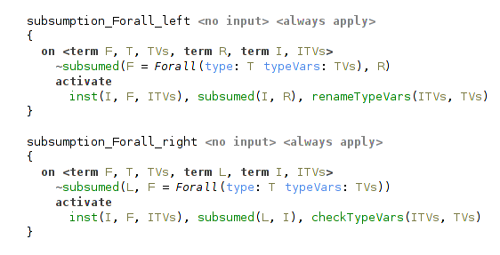  
_(subsumption rules for universal types)_

Another important case is that of leaves, when one of the types is either a type variable reference or a free type variable (either instantiated or initially free, that is, not bound during the process of type inference).
In the case of free type variable we unify it with another term, essentially instantiating type variable to it.
If there will be _conflicting instantiations of the same type variable to different types_, unification will fail and halt typechecking.

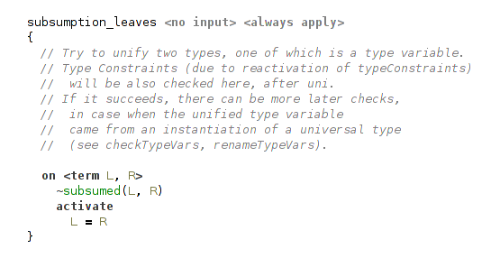  
_(leaves in subsumption are unified)_

But if the second term is a free type variable too, then unification will succeed and we may need to perform additional check.
For example, consider checking subsumption relation for this case: `∀a b.(a,b) ≤ ∀c.(c,c)`.
As you can see, subsumption relation doesn't hold here, because the second type is not more general than the first.
In the subsumption rules for universal types all bound type variables will be instantiated, and we will need to check `subsumed(Pair(A,B), Pair(C,C))`, where `A`, `B` and `C` are free (instantiated) type variables.
Rule for leaves will successfully unify `A` with `C` and then also `B` with `C`, and we will get `A=B=C`.
But this is certainly not what we want!
That's why, besides unification in the rule for leaves, we need an additional check ensuring that there're _no conflicting instantiation of one type variable to several different type variables_.
This check is relevant only for free type variables coming from the instantiation of universal types.
So it is performed only in the rules for universal types.

In the case of variable references (that is, type variables bound by some universal quantifier) they must match because these variables are _rigid_, and they can't be unified. This case is essentially the same as in Haskell, where, for example, two type variables with different names entered by a user can't be unified.

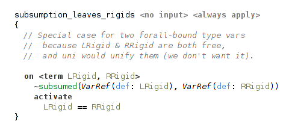  
_(rigid type variables in subsumption are checked for equality)_
    <!-- TODO example from haskell? from here? -->

Subsumption rule for function types proceeds by checking argument and result types.
It is analogous to typical subtyping rules for function types: argument types are checked contravariantly, result types are checked covariantly.

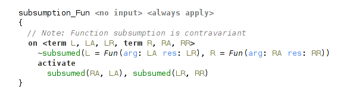  
_(subsumption rule for function type)_

Rule for a pair type is straightforward.

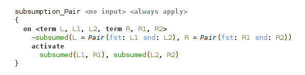  
_(subsumption rule for pair type)_

That's how implementation of a complex relation on types can look like in Code Rules.

<!-- [^odersky1996] -->
[^spjones2007]: [Practical type inference for arbitrary-rank types](https://www.microsoft.com/en-us/research/wp-content/uploads/2016/02/putting.pdf)
