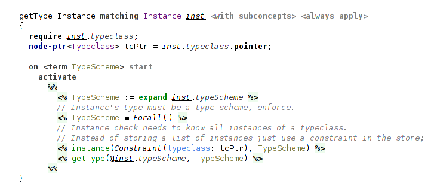

### Typeclasses

Haskell typeclasses are one of the most important and complex features of its type system, that distinguishes Haskell among other well-known functional languages.
Implementing typeclasees using Code Rules shows that it has expressive power that is sufficient even for the advanced type systems.
This implementation partly relies on the reference Haskell typechecker[^thih].

_Note about notions: by the word "constraints" are meant Code Rules constraints, whereas typeclass constraints are called in this qualified way ("typeclass constraints"), or with an uppercase letter ("Constraints") to avoid ambiguity._

#### Typeclass Constraints

In essence, typeclasses extend type system by adding a kind of requirements, Constraints on type variables that are bound by universal quantifier.
Type system needs to carefully track that universal types are instantiated only to the types satisfying their Constraints, and that the types are generalized to universal types properly, without leaving out any Constraints.

For example, we can instantiate a universal type `∀ a. (C1 a, C2 a) ⇒ (a, a) → a` only to a type that satisfies both Constraints `C1` and `C2`.
Or, in case of a generalization, given a function `mappend ∷ ∀ a. Monoid a ⇒ a → a → a`, for a function `f` in `let f = (\x → mappend x x)` we must infer a type `∀ t. Monoid t ⇒ t → t`.

Everything else is mostly a matter of other language aspects (structure, editor and constraints aspects) and not of a type system.
Still, it's important to note, that type system doesn't need to check that type variables are properly scoped, because it is handled by "constraints" language aspect.
It slightly simplifies the type system.
    <!-- MAYBE MOVE IN PREVIOUS SECTION ABOUT STLC? -->

So, existing type system needs to be modified only in the places concerned with universal types:
- modification of generalization & instantiation of type variables in `forall` handler;
- straightforward additions in macro table `types` and `recover` handler.

The major part of typechecking typeclasses is placed in several new handlers:
- handling declarations of typeclasses and its instances --- in `typeclasses` handler;
- processing typeclass constraints (collecting and checking them) --- in `typeConstraints` handler;
- implementation of the Set data structure, used mainly in `typeConstraints` handler --- in `set` handler.

Now, let's move through these handlers.

#### Set Data Structure

Handler `set` implements the Set data structure together with several utility functions.
A set is represented as a number of `set` constraints in the constraint store.
Each `set` constraint has 2 arguments: the first argument is a free logical variable representing handle for the data structure and the second argument is an element belonging to it.
As an example, a set `{a, b, d}` (where a, b and d are some dataforms or free logical variables) will be represented as three constraints: `set(S1, a)`, `set(S1, b)` and `set(S1, d)`, where `S1` is a Set handle.
Programmer can manipulate the set with a handle.
The implementation consists of a single rule that maintains the set invariant, i.e. that it can't contain two equal elements.
<!-- Notice that the `equals` predicate is used here. -->

  
_(set data structure implementation)_

The beauty of such representation of a set is that merging sets comes essentially for free and, moreover, is performed implicitly.
To merge two sets a programmer only needs to unify their handles.
And there one crucial feature of Code Rules enters the picture: constraint reactivation.
When arguments of inactive constraints in the constraint store change (for example, are unified with something), these constraints are reactivated.

Consider the following example.
Assume there're two sets `S1 = {a, b}` and `S2 = {a, c}` and the constraint store contains four constraints representing them: `set(S1, a)`, `set(S1, b)`, `set(S2, a)` and `set(S2, c)`.
Next, unification of logical variables `S1` and `S2` happens (`S1 = S2`).
Due to automatic reactivation, all inactive constraints in the store that refer to these unified variables will be activated again.
Because of this they will be tested for matching on the rule maintaining set invariant.
In this particular case it will be triggered on the constraints `set(S1, a)` and `set(S2, a)` (remember, here `S1=S2`) and discard one of them.
After this constraint store will contain only three `set` constraints (`set(S1, a)`, `set(S1, b)` and `set(S1, c)`), representing the result of merging `{a, b}` and `{a, c}`, a set `{a, b, c}`.
The implementation of a set is also an example of one useful Code Rules pattern: maintaining some invariant assumed by other rules using a top-level rule, that will be matched first and ensure invariant.

Handler `set` also declares several utility functions with straightforward implementations:
- copying a set;
- making a Cons-list out of a set while removing the original set;
- making a Cons-list out of a set while preserving the original set;
- testing whether one set is a subset of another.

  
_(copy a set)_

  
_(test whether one set is a subset of another)_

#### Representation of Typeclass Constraints

Typeclass constraints are used in 2 roles during type checking: in definitions of type variables bound by quantifiers and as requirements on types.
Handler `typeConstraints` declares 2 constraints that correspond to these 2 roles: `tdefConstraints` and `typeConstraints`.
They map a type variable to a set of its typeclass constraints.
Contrast it with how type variables are represented: they're explicitly stored in a list in the `Forall` dataform.
Thus, typeclass constraints on a type variable are stored implicitly, not inside the `Forall` dataform, but in the constraint store.
Their representation as a set greatly simplifies working with them.

During the process of type inference free logical variables representing yet unknown types can be unified.
Previously we haven't given much thought to it, unification just happened without our attention.
<!-- But what happens now, when they can carry sets of typeclass constraints? -->
But now consider this question: what changes when free type variables can carry sets of typeclass constraints?
The answer is that we should merge these sets when variables are unified.
But at which point? The problem is that unification can happen at any point (in any rule) during type inference.
And that's where constraint reactivation again helps us, now for `typeConstraints` and `tdefConstraints`.
The following rule is a top rule in handler `typeConstraints`.
It ensures, that each type variable has a single set of all its typeclass constraints.

.png)  
_(merging Constraints sets)_

It is clear how to collect typeclass constraints during the process of type inference.
But what we further need to do with this set of typeclass constraints depends on what happens to the type variable.
There're two cases: it either remains free until the point of generalization (i.e. let-binding) or it is bound to a type.

#### Checking Typeclass Constraints

When free type variable becomes bound to something, we need to check that all typeclass constraints collected up to this point are satisfied.
Due to constraint reactivation, another rule that starts this check will be triggered.

  
_(rule playing a role of entry point to typeclass constraints check)_

There're 2 cases: it can be bound to a ground type (e.g. function type, Bool) or a type variable reference.
The cases differ and require different checks.

  
_(check collected typeclass constraints for a type variable: 2 cases)_

##### Strength Check

First, let's consider a slightly less obvious case of a type variable reference.
It refers to a type variable bound by some universal quantifier, and so, as part of its definition, has its own set of typeclass constraints.
This set must be more restrictive than the set of collected typeclass constraints we need to satisfy.
In other words, the type variable can't be instantiated to a type (here, type variable reference) that doesn't satisfy its typeclass constraints.
To check it we need to ensure that for each Constraint from the set of collected ones there's a matching Constraint to satisfy it.
It can be done with a `isSubset` check.

  
_(strength check: checking the restrictiveness of two Constraint sets)_

For example, given a function application `f x` with types `x ∷ C1 t ⇒ t` (`t` is bound somewhere else) and `f ∷ ∀ a.(C1 a, C2 a) ⇒ a → a`, the strength check will clearly fail, because the Constraints set `{C1}` on the type variable `t` _is not more restrictive_ than the set `{C1, C2}`. The set `{C1, C2}` is not a subset of `{C1}`.

##### Instance Check

The second case of a usual type is more intuitive and more common, but its implementation is a bit more involved.
The first two rules in it do nothing special: the first makes a list out of the set and the second traverses it, triggering actual instance check for each typeclass constraint on a type.

.png)  
_(instance check, first two rules)_

The next two rules try to find a matching instance among all instances of the typeclass with a help of `instance` constraint.
It is present in the constraint store for each declared typeclass instance in a program.
Typeclass instances can be declared not only for types but also for type schemes.
For example, Haskell has the following instance of `Monoid` typeclass: `instance Monoid [a]` where the instance is declared for a universal type `forall a. [a]`. Compare it to `instance Monoid Bool` where we have a usual type `Bool`.
That's why we need to try instantiating the type scheme from instance declaration to the type in question.
It is done with a combination of `inst` constraint and unification.
It's important to note, that instantiation here may trigger recursive `instanceCheck`.

For example, consider how `instanceCheck(Pair(Bool, Bool), {Monoid})` proceeds in presence of `instance Monoid Bool` and `instance (Monoid a, Monoid b) => Monoid (a, b)` in a program.
Here we first need to find an instance for pairs, and then additionally check its own Constraints: that there exist instances for both element types of a pair. The type `(Bool, Bool)` satisfies this requirement given these 2 instances.

The last rule simply fails in case when no matching instance is found.
The typecheck is failed by triggering `eval(false)`.
Of course, it isn't the best mechanism for reporting type system errors, but it's a temporary solution.

<!--    -->
.png)  
_(instance check: searching for a typeclass instance for a type)_

#### Universal Types and Typeclass Constraints

Typeclasses require only a little change to `forall` handler.
In the rule for generalization of a type variable we have to add only a single production that moves collected typeclass constraints (in `typeConstraints`) to a definition (`tdefConstraints`).

  
_(generalization over a single type variable: notice activation of `produceTypeConstraints`)_
<!-- _(notice `produceTypeConstraints` production)_ -->

  
_(collected typeclass constraints become part of the type variable definition)_

The constraint `tdefConstraints` is used in an instantiation of a type variable.
We essentially do the opposite: we copy typeclass constraints from the definition (`tdefConstraints`) to a new set (in `typeConstraints`) for a freshly instantiated type variable.

  
_(instantiation of a single type variable: notice activation of `typeConstraints` with a copied set)_
<!-- _(notice activation of `typeConstraints` with a copied set)_ -->

#### Typeclass and Instance Declarations

Handler `typeclasses` extends `annotation` handler and declares no new constraints.
It ensures the well-formedness of typeclass and instance declarations, and defines typechecking dependencies using `require` statements.

The rule for typeclass declaration only processes declaration of type variable declared in a typeclass and produces an auxiliary constraint carrying typeclass name, used in `recover` handler.

  
_(processing typeclass declaration)_

The rule for instance declaration is also straightforward. It expands a macro for its type scheme and produces `instance` constraint that is used in `instanceCheck`.

  
_(processing instance declaration)_

Typeclass contains a number of function Prototype declarations (i.e. pairs of symbol and type).
The rule for them just produces their type given type annotation.

  
_(producing type of a Prototype in a typeclass)_

Instance, correspondingly, contains Prototype implementations, and they require the most involved rule.
It checks that the actual type of the implementation agrees with a Prototype's type.
The first step of this is to instantiate the generic Prototype to the Instance type scheme.
The second step is to actually check that the types agree, that is, the type of the implementation does not restrict the Prototype's type (in other words, it is more general). It is checked using subsumption relation.

  
_(checking correctness of Prototype implementations)_

<!-- ##### Conclusion -->

That is everything there is to the typechecking of typeclasses.
To recap, the most important rules are concerned with processing typeclass constraints.
They're implemented in a way to be triggered automatically, while other rules heavily rely on this automatic and implicit checking of typeclass constraints.
<!-- So, these rules for processing declarations and universal types are simpler than they could have been. -->

<!-- TODO -->
<!--     `types` --- trivial -->
<!--     `recover` --- nothing special, has already been described. -->
<!--         but SHOW recovering Constraints? -->
<!-- .to mention -->
<!--     aux constraint for 'recover' to avoid unnecessary dependencies -->

[^thih]: See [Mark P. Jones. "Typing Haskell in Haskell"](https://web.cecs.pdx.edu/~mpj/thih/thih.pdf).

<!--    -->
<!-- _()_ -->

